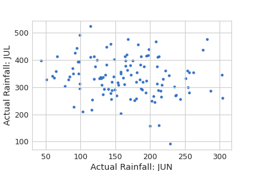
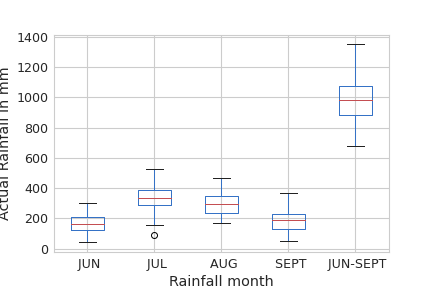
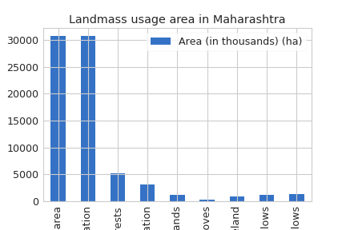

## DS 200 Course Module 4

**Literature Review and Software tooling**

Following plots on gov.in data 
- Scatter
- Box
- Bar
Sample files of each plot are stored in folder img/

### How to run
1. Set up a python3.x + jupyter environment and install pandas.
2. Download the repo
3. Run plotter.ipynb notebook

An example of each of these plots:
**a. Scatter Plot**

**Observation:** The scatter plot above shows the correlation between rain fall in two peak mansoon months in central region of India, prominantly Maharashtra.

**b. Box plot**

**Observation:** From the plot we observe that the min, max and median values of the rain fall in highest in the month of july. 

**c. Bar Plot**

The plot shows land mass utilisation in various sectors from forests, industrial and agricultural among the total area of mass surveyed. The domestic presence is of significace.

